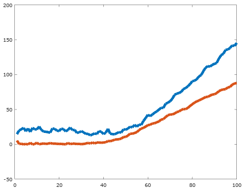

# Experiment: char-rnn

I created a [char-rnn branch](https://github.com/unixpickle/char-rnn/tree/rwa) that uses RWA. The results exceeded my expectations.

In this experiment, a two-layer RWA with 512 hidden units per layer is trained to predict the next character in a string. In particular, strings are random 100-byte sequences taken from [Android app descriptions](https://github.com/unixpickle/appdescs). These strings may be taken from *anywhere* within a description: mid-sentence, mid HTML tag, etc.

Quantitatively, the network achieves a cross-entropy loss of around 1.40 nats per byte (with virtually no overfitting). I trained the network for 8.9 epochs (about 80K batches of 32 samples each). This took ~10 hours on a Titan X GPU. An equivalent LSTM (with 2 layers and 512 cells each) achieves the same cross-entropy in about 6K batches (7.5% of the number of training steps). After 16K batches, the same LSTM achieves a cross-entropy closer to 1.28 nats, at which point it seems to plateau.

Qualitatively, we can look at some strings generated by the trained RWA model:

```
id that you. The tourist now! If you is not eurislicy of kids7 rin cluide free!
</p><p>Complete whil
```

```
ifmills for your own phone Backbook Do Ore can egen  Process.</p><p></p><p></p><
p></p><p></p><p></p>
```

```
S Provide you will be sticker applications that you have to your account!<br/>No
graphy conversation
```

Those strings are being generated character-by-character. It's clear that the model has learned to spell some pretty long words (e.g. "applications"). It also knows some HTML!

So, how does the RWA do it? Modeling text like this requires the ability to model short-term dependencies as well as long-term ones. To figure out what the model was doing, I plotted the maximum and mean context weight (in the log domain) at each timestep in a sequence. Here's what I saw:

Mean log-weight:


Max log-weight:



In the above graphs, the red line is for the first layer (which sees inputs), and the blue line is for the second layer (which feeds outputs to the softmax layer). As you can see, the mean weight increases monotonically throughout the sequence. This explains how the network is able to model short-term dependencies.

Here are some samples generated by the LSTM mentioned above. They are similar in quality to those generated by the RWA:

```
ough the map. That will make your new if you wish you up, we syded to the same time for? Go to where
```

```
Facebook etc........<br/>G  collect fruit often for power using paste/SMS</p><p>&gt; Animated Dis
```

```
sight to get the Samsung Galaxy AS Kids cash chat news undeessage with up tok tasks!</p><p>The most
```
