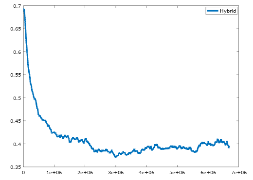

# Experiment: Sentiment Analysis

This tests the RWA on a pretty routine task: Twitter sentiment analysis. The model is fed a Tweet byte-by-byte. The network's last output is used to classify the tweet as "positive" or "negative".

# Data

This uses the data from [Sentiment140](http://help.sentiment140.com/for-students/).

# Models

In this experiment, I compare three different character-level models. Each model reads a tweet as a sequence of bytes, then produces a single classification at the last time-step.

Here are the three models:

 * Pure LSTM: a two-layer LSTM model, with 384 cells per layer.
 * Pure RWA: a two-layer RWA model, with 384 cells per layer.
 * Hybrid: a two-layer model where the first layer is an LSTM and the second is an RWA.

The hybrid model was inspired by the idea that the LSTM could deal with short-term dependencies (e.g. the spellings of words) while the RWA could deal with long-term dependencies. Essentially, the LSTM processes the raw character inputs and feeds higher-level data for the RWA to process on a longer timescale.

# Results

I trained the models for 1.5 epochs on this task. I found that the hybrid model learns significantly faster than the LSTM, especially at the beginning of training. Here is a graph comparing all three models, with number of samples along the x-axis and validation cross-entropy on the y-axis:

The pure LSTM achieved an average validation cross-entropy of 0.39 during training. At the end of training, the validation accuracy was 86.1%. Note that the original Sentiment140 paper only managed to achieve 83.0% accuracy, and that required a ton of feature engineering.

The hybrid LSTM-RWA achieved an average validation cross-entropy 0.37 during training, but only 83.8% validation accuracy. This can likely be explained by sample noise near the end of training. If the learning rate were annealed during training, we would likely find that the LSTM and hybrid models had similar validation accuracies at the end. It is clear from the average cross-entropy (which, as a moving average, is more reliable than accuracy) that the hybrid LSTM was doing slightly better than the pure LSTM.

The pure RWA achieved an accuracy of 79.4% at the end of training, not to mention its much worse cross-entropy.

As an extra experiment, I trained the hybrid model for a few more epochs with a smaller learning rate. It overfit significantly:

